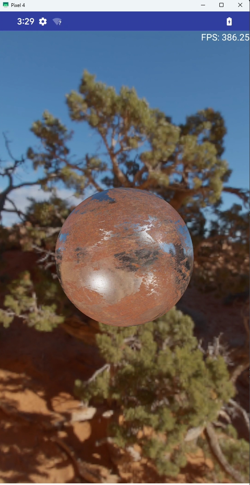

# ScreeShot

    
    
    
    
Foveation Rendering, PBR_IBL, 3DGS on Android GLES

  

    
    
windows defer shading (W, S, A, D + Mouse to navigate)

  

# Build
## Android Build
* android studio open androidProject folder, then build

### cppsrc view in android studio
* Switch bar to Project view
* cppsrc folder right click, Mark Directory as -> Sources Root

## Windows Build
* Toplevel CMakeLists.txt has to be in same folder as vcpkg.json, then vcpkg will run in manifest-mode
[manifest-mode tutorial](https://learn.microsoft.com/en-us/vcpkg/consume/manifest-mode?tabs=cmake%2Cbuild-cmake)

* download repo with submodules
`git clone --recurse-submodules url`

* visual studio project build, default only has x64
`cmake -G "Visual Studio 17 2022" -A x64 -S . -B ./vsProject/`

* this will has other build plateform -A Win32/x64/ARM/ARM64
`cmake -G "Visual Studio 17 2022" -A Win32 -S . -B ./vsProject/`

* [can't generate both](https://stackoverflow.com/questions/28350214/how-to-build-x86-and-or-x64-on-windows-from-command-line-with-cmake)

* CMAKE_TOOLCHAIN_FILE=vcpkg/scripts/buildsystems/vcpkg.cmake added in CMakeLists.txt

* build visual studio project by cmake
`cmake --build .\vsProject`

### submodule added
* vcpkg